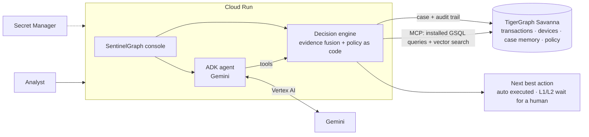

# SentinelGraph

**An agentic fraud investigator for banks, built with Google's Agent Development Kit and Gemini, running on Cloud Run.**

*Google Cloud AI Builder Cup 2026 · BFSI theme*

| | |
|---|---|
| Live demo | _Cloud Run URL (added after deploy)_ |
| Demo video | _3-minute video (coming)_ |
| Proposal deck | _PDF (coming)_ |

---

## The problem

A card issuer's fraud team is never short of alerts. It is short of time to turn each alert into a decision it can defend to a customer, an auditor and a regulator. For every alert an analyst pulls the card history, checks the device, looks for other victims, rereads the policy, decides whether to contact the customer and writes it all up, usually after the money has moved.

Generic chatbots do not solve this. In a regulated bank an AI that invents a reason, a probability or a "shared device" link is worse than no AI at all.

## What SentinelGraph does

SentinelGraph works an alert the way a careful analyst would, and shows its work:

1. **Investigates.** It opens a case and gathers evidence from a graph of 590,742 card transactions, devices, email domains and billing regions: the card's history, the device's use on other cards, near-identical purchases on other cards, and similar closed investigations.
2. **Says what it does not know.** Evidence is weighed in independent families, so correlated signals cannot pile up. Every case records its confidence and its open questions.
3. **Asks for the evidence that would settle it.** Step-up authentication, customer verification or an analyst review, as the policy allows.
4. **Recommends the next best action with its approval route.** Auto actions run; blocking a card waits for a team lead (L1); filing a suspicious activity report waits for a fraud manager (L2).
5. **Explains itself in plain English.** Analysts talk to a Gemini agent ("Investigate HHG-003", "How are the cards in HHG-006 linked?", "Why does blocking need a team lead?") that calls the tools and cites the policy.
6. **Remembers.** Every case is written back to the graph with its audit trail, so the next investigation can find it.

## Built on Google Cloud

| Google Cloud | How SentinelGraph uses it |
|---|---|
| **Agent Development Kit (ADK)** | The analyst-facing agent (`sentinel_adk/`). Gemini decides which of six tools to call: investigate an alert, load a saved case, list alerts, look up a transaction, search the policy, search case memory. ADK callbacks implement the guardrails below. |
| **Gemini on Vertex AI** | Every Gemini call in the cloud goes through Vertex AI with the Cloud Run service account, so there is no API key in the deployment: the ADK agent, and the case writer that drafts summaries and SAR narratives (validated before use; any unsupported ID or link claim falls back to a template). |
| **Cloud Run** | One container serves the analyst console and the ADK agent, with session affinity for the console's websocket. |
| **Secret Manager** | Holds the graph credential, injected at deploy time. Nothing secret is in the image or the repo. |
| **Cloud Build + Artifact Registry** | `gcloud run deploy --source .` builds the `Dockerfile` and stores the image. |
| **IAM** | A dedicated service account with only Secret Manager access and `roles/aiplatform.user`. |

The graph itself lives on TigerGraph Savanna and is reached through the official TigerGraph MCP server.

## Architecture



## Trust by design

The point of an AI investigator in a bank is decisions you can defend. SentinelGraph draws a hard line between what Gemini may do and what it may not:

- **Gemini explains; the engine decides.** Verdicts, fraud probabilities, next best actions, approval routes and SAR decisions come only from the deterministic engine behind `investigate_alert` and `get_saved_case` (`agent/signals.py`, `agent/policy.py`). The same evidence always gives the same decision.
- **No tool executes an action.** The agent can recommend blocking a card; only a human can approve it, and the approval is written to the case's audit trail.
- **An answer guardrail on every reply.** An ADK `after_model_callback` removes any sentence that cites a card, customer, transaction or case ID that no tool returned, or that claims a link between cards (shared device, ring, shared email) which the current case's evidence does not contain.
- **Link mechanisms come from the data.** Each connected card carries the kind of link the detector found (`shared_device`, `peer_device`, `peer_email`, `structuring`), and the sentence explaining it is written in code, not by the model.
- **A validator for every answer file.** `python validate_answers.py` checks every ID, exposure sums, approval routes, SAR consistency and every stated link mechanism against the raw data.
- **Policy as code.** Fraud Policy rules R1 to R10, the stop rule (act at 85% or 15% with two independent lines of evidence) and a guard that refuses breaches such as blocking on one weak signal.

### Example (live run on HHG-006, abridged)

> **Analyst:** Pull up HHG-006. How are the connected cards linked, and is this a device-sharing ring?
>
> **SentinelGraph:** Verdict: fraud (probability 0.99). Next best action: BLOCK_CARD (L1 team lead). The cardholder reported the charge as unauthorised, and it is part of a burst of 4 online purchases within 30 minutes, each just under $500, totalling $1,906.07. The 11 connected cards are linked by amount and timing only: the same just-under-$500 structuring pattern. This is not a device-sharing ring; none of them shares a device profile with this card.

## Results on 20 benchmark alerts

10 legitimate, 9 fraud, 1 uncertain; six SARs drafted for fraud-manager sign-off. Every decision reproduces exactly on re-run. Answer files are in [`cases/`](cases/), full step-by-step traces in [`traces/`](traces/).

<details>
<summary>All 20 cases</summary>

| Case | Verdict | P(fraud) | Pattern | Exposure | Connected cards | SAR | Evidence requested | Final next best action |
|---|---|---|---|---|---|---|---|---|
| HHG-001 | legitimate | 0.01 | none | $0.00 | 0 | no | none | ALLOW_TRANSACTION → GENERATE_REPORT → CLOSE_NO_FRAUD |
| HHG-002 | legitimate | 0.01 | none | $0.00 | 0 | no | step_up_auth | ALLOW_TRANSACTION → CREATE_CASE → CLOSE_NO_FRAUD |
| HHG-003 | uncertain | 0.63 | out_of_region_use | $49.00 | 0 | no | customer_validation | BLOCK_CARD → CREATE_CASE → ESCALATE_TO_ANALYST |
| HHG-004 | fraud | 0.73 | card_not_present_new_device | $128.33 | 0 | no | customer_validation | BLOCK_CARD → CREATE_CASE |
| HHG-005 | legitimate | 0.01 | none | $0.00 | 0 | no | step_up_auth | ALLOW_TRANSACTION → CREATE_CASE → CLOSE_NO_FRAUD |
| HHG-006 | fraud | 0.99 | **undocumented** (threshold structuring) | $1,906.07 | 11 | yes | none | BLOCK_CARD → CREATE_CASE → FILE_REPORT → MONITOR_CONNECTED_CARDS → ESCALATE_TO_ANALYST |
| HHG-007 | legitimate | 0.01 | none | $0.00 | 0 | no | none | ALLOW_TRANSACTION → GENERATE_REPORT → CLOSE_NO_FRAUD |
| HHG-008 | fraud | 0.99 | card_not_present_fraud | $166.97 | 1 | yes | none | BLOCK_CARD → CREATE_CASE → FILE_REPORT → MONITOR_CONNECTED_CARDS |
| HHG-009 | fraud | 0.98 | card_not_present_fraud | $30.02 | 0 | no | none | BLOCK_CARD → CREATE_CASE |
| HHG-010 | legitimate | 0.01 | none | $0.00 | 0 | no | step_up_auth | ALLOW_TRANSACTION → CREATE_CASE → CLOSE_NO_FRAUD |
| HHG-011 | fraud | 0.95 | card_not_present_new_device (shared device) | $131.30 | 5 | yes | none | BLOCK_CARD → CREATE_CASE → FILE_REPORT → MONITOR_CONNECTED_CARDS |
| HHG-012 | legitimate | 0.01 | none | $0.00 | 0 | no | none | ALLOW_TRANSACTION → GENERATE_REPORT → CLOSE_NO_FRAUD |
| HHG-013 | legitimate | 0.01 | none | $0.00 | 0 | no | step_up_auth | ALLOW_TRANSACTION → CREATE_CASE → CLOSE_NO_FRAUD |
| HHG-014 | fraud | 0.89 | **undocumented** (device-sharing ring) | $439.61 | 27 | yes | none | BLOCK_CARD → CREATE_CASE → FILE_REPORT → MONITOR_CONNECTED_CARDS → ESCALATE_TO_ANALYST |
| HHG-015 | legitimate | 0.01 | none | $0.00 | 0 | no | step_up_auth | ALLOW_TRANSACTION → CREATE_CASE → CLOSE_NO_FRAUD |
| HHG-016 | fraud | 0.99 | card_not_present_new_device (shared origin) | $59.67 | 3 | yes | none | BLOCK_CARD → CREATE_CASE → FILE_REPORT → MONITOR_CONNECTED_CARDS |
| HHG-017 | legitimate | 0.03 | none | $0.00 | 0 | no | none | ALLOW_TRANSACTION → GENERATE_REPORT → CLOSE_NO_FRAUD |
| HHG-018 | legitimate (disputed recurring charge, R7) | 0.02 | none | $0.00 | 0 | no | customer_validation | CREATE_CASE → WARN_CUSTOMER → CLOSE_NO_FRAUD |
| HHG-019 | fraud | 0.99 | card_not_present_new_device (shared device) | $99.92 | 4 | yes | none | BLOCK_CARD → CREATE_CASE → FILE_REPORT → MONITOR_CONNECTED_CARDS |
| HHG-020 | legitimate | 0.01 | none | $0.00 | 0 | no | step_up_auth | ALLOW_TRANSACTION → CREATE_CASE → CLOSE_NO_FRAUD |

</details>

Beyond the benchmark, `monitor.py` scans the graph with no alert at all. It found 57 suspicious shared-device profiles and 12 cards with the structuring pattern, and opened 6 cases ([`proactive/`](proactive/)).

Highlights:

- **Threshold structuring (HHG-006).** A pattern not in the bank's documented typologies: four online purchases in 30 minutes, each just under $500. The same pattern appears on 11 other cards and matches five undocumented closed cases.
- **A 28-card device ring (HHG-014).** One device profile behind an anonymous proxy, marked New on every account, isolated as one component by weakly connected components.
- **Fraud you cannot see from one card (HHG-011, HHG-016, HHG-019).** Each purchase looks ordinary on its own card; the graph shows the same rare device or email pair making near-identical purchases on other cards within days.
- **Honest about doubt (HHG-003).** A denied $49 purchase in a region the card uses all the time: the card is protected, but the case stays uncertain and goes to an analyst.

## How it works

| Layer | What it does | Where |
|---|---|---|
| **Evidence graph** | Customer, Card, **Client** (latent cardholder = card + billing region + account-open day), Txn, DeviceProfile, EmailDomain, BillingRegion; `NEXT_TXN` chains per card | `graph/schema.gsql` |
| **Case memory** | 5,565 `ClosedCase` vertices (with embeddings, linked to their transactions, cards, connected cards and pattern) + every `FraudCase` the agent opens, with `CaseEvent` audit trail and `FC_SIMILAR_CC` links to the memory it used | `graph/schema.gsql`, `agent/case_store.py` |
| **Knowledge (RAG)** | Fraud policy (split per rule), the five typologies, a digest of the FinCEN/FATF/FFIEC references, lessons mined from closed cases, all as `PolicyChunk` vertices in the vector index | `knowledge/`, `agent/knowledge.py` |
| **GSQL** | 16 installed queries: transaction context, card window, behavioural baseline (GSQL accumulators), latent-client history, device fan-out, 2-hop peer transactions on other cards, case memory by customer and by device, structuring scan, device-ring scan, **WCC ring components**, vector search ×3, case timeline, stats | `graph/queries/` |
| **MCP** | Every graph read goes through the official `tigergraph-mcp` server (`tigergraph__run_installed_query`), discovered at runtime; RESTPP fallback | `agent/mcp_bridge.py`, `agent/backends.py` |
| **Evidence & uncertainty** | Detectors emit citable claims with likelihood ratios in independent families (ml, trigger, sequence, network, device, behaviour, history, customer). Fusion in log-odds, capped per family so correlated signals are not double counted. Confidence and open questions are explicit | `agent/signals.py` |
| **Case-memory model** | Gradient boosting trained on the bank's *own* closed cases (July to September), validated on October: **AUC 0.914 vs 0.866** for the bank's risk score (AP 0.44 vs 0.25). Used as the calibrated prior, never as a verdict | `prep/train_memory_model.py` |
| **Policy engine** | Fraud Policy v1.0 as code: rules R1 to R10, case vs report (3a), stopping (6), approval routes, ordering, and a guard that flags breaches (R1 block on a single weak signal, R10 misuse, R7 block of a recurring dispute) | `agent/policy.py` |
| **Controlled evidence gathering** | `VERIFY_WITH_CUSTOMER`, `STEP_UP_AUTH`, analyst requests. Replies are simulated **consistently with the evidence**, and the assumption plus its basis is written into `evidence_requests` | `agent/simulator.py` |
| **LLM** | (1) a bounded investigator that may call up to N extra graph/RAG tools via function calling, and (2) the writer for summary, SAR narrative, pattern description, what changed and stop reason. **Output is validated**: text that cites an ID not in the evidence is rejected and a deterministic template is used instead. The LLM never sets probabilities or actions | `agent/llm.py`, `agent/orchestrator.py` |
| **UI** | SentinelGraph console. Investigate opens on the incoming alert; a live run streams every MCP/RESTPP tool call, then shows what happened / what the agent found / how certain / what next, the next best action with its approval route and governance, evidence sufficiency and why it stopped, decision evolution, the investigation graph, evidence → assessment → decision, and a comparison with the previous run. Case Portfolio opens saved investigations. Also: Alert Queue (incl. proactive alerts), Investigation Graph, Fraud Patterns, Case Memory (vector search), Policies (GraphRAG), Agent Activity, Audit Log. Approvals are written to the case audit trail in TigerGraph | `ui/` |
| **ADK agent** | Gemini agent with six tools over the engine and the graph, session state, and before-agent, after-tool and after-model callbacks for the guardrails | `sentinel_adk/` |
| **Deployment** | Dockerfile, Cloud Run deploy script with Secret Manager, service account and Vertex AI | `Dockerfile`, `deploy/deploy.ps1` |

Case memory is a model as well as a lookup: a gradient-boosted model trained on the bank's own 5,565 closed investigations scores AUC 0.914 on an October hold-out, against 0.866 for the bank's risk score. It sets the starting probability, never the verdict.

## Run it

**Locally** (Python 3.10+):

```
pip install -r requirements.txt
cp .env.example .env            # TG_HOST, TG_SECRET, TG_GRAPH, GEMINI_API_KEY
python -m streamlit run ui/app.py   # console at http://localhost:8501, page "Ask the agent"
adk web                         # ADK dev UI, pick sentinel_adk
python run_cases.py             # re-run the 20 benchmark alerts
python validate_answers.py
```

`GRAPH_BACKEND=local` runs everything against an in-memory mirror of the graph queries, with no TigerGraph account needed.

**On Cloud Run** (Windows PowerShell, from the repo root, with the gcloud CLI signed in and a project with billing):

```
.\deploy\deploy.ps1 -Project <your-gcp-project>
```

The script enables the APIs, copies the graph secret from `.env` into Secret Manager without printing it, creates the service account, builds the image with Cloud Build and deploys the service. Gemini runs on Vertex AI, so no Gemini API key goes to the cloud; locally, `GEMINI_API_KEY` is used instead.

Rebuilding the graph from the raw data: `python -m prep.prepare_data --raw <data dir>` then `python -m graph.setup_graph` (schema, vectors, data, case memory, policy and 16 installed queries).

## Repository layout

```
sentinel_adk/   ADK agent (Gemini), tools, guardrail callbacks, chat runner
agent/          orchestrator, evidence detectors, policy engine, link mechanisms, LLM writer, MCP bridge, backends
ui/             SentinelGraph console (Streamlit)
graph/          TigerGraph schema, vector schema, 16 GSQL queries, setup script
prep/           data preparation and the case-memory model
knowledge/      fraud policy, typologies, regulatory digest (GraphRAG corpus)
cases/ traces/  benchmark answers and full investigation traces
proactive/      cases found by the graph scan with no alert
deploy/         Cloud Run deploy script        Dockerfile, .gcloudignore
```

## Origin and what is new

SentinelGraph began as our entry to the TigerGraph × Hacker House Goa 2026 agentic fraud task ([repo](https://github.com/nirmaljosephukken/HH_GOA_Task_4)), built in the same period as this event. New for the AI Builder Cup:

- the Gemini agent on Google's ADK, with tools over the engine and graph, and the answer guardrail;
- the "Ask the agent" console page;
- deployment on Cloud Run with Secret Manager, a least-privilege service account and all Gemini calls on Vertex AI (no API key in the cloud);
- link-mechanism grounding extended to every model-written sentence, after judge feedback on the earlier version.

## Honest notes

- The dataset is the public IEEE-CIS card data with the fraud label removed, plus a bank risk score, closed investigations and a fraud policy provided by the task. No real customer data is used.
- Customer, step-up and analyst replies are not available in the data. The engine assumes the reply the evidence supports, never a hidden label, and writes the assumption into the case.
- Gemini never sets a probability or an action. If you find a reply where it appears to, that is a bug we want to hear about.
